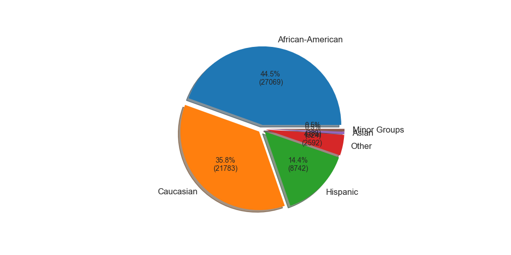
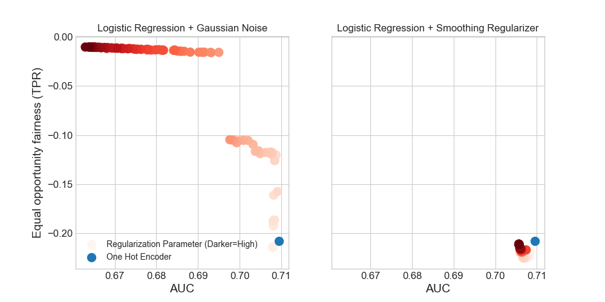
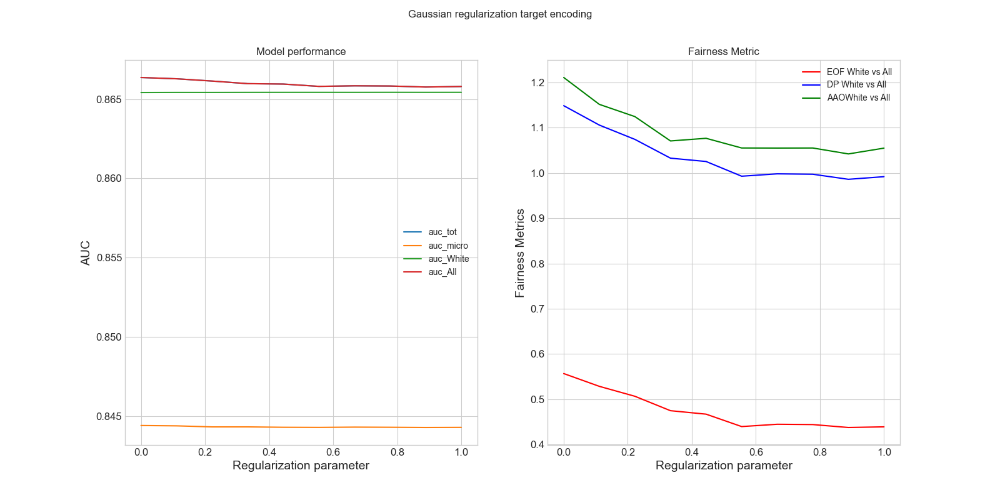

[](https://github.com/psf/black)
[](https://opensource.org/licenses/MIT)
[](https://www.python.org/downloads/release/python-390/)

# Fairness implications of encoding protected categorical attributes

Protected attributes are often presented as categorical features that need to be encoded before feeding them into a machine learning algorithm. Encoding these attributes is paramount as they determine the way the algorithm will learn from the data. Categorical feature encoding has a direct impact on the model performance and fairness. In this work, we compare the accuracy and fairness of the two most well-known encoders: One Hot Encoding and Target Encoding. We distinguish between two types of induced fairness that can arise while using these encodings. A first type is due to direct group category bias and a second type is due to large variance in minor groups. We take a deeper look into how regularization methods for target encoding can improve the induced bias while encoding categorical features. Furthermore, we tackle the problem of intersectional fairness that arises when mixing two protected categorical features leading to higher cardinality, boosting the model performance and increasing the discrimination of the machine learning model.

## COMPAS dataset

COMPAS is an acronym for Correctional Offender Management Profiling for Alternative Sanctions, 

The input used for the prediction of recidivism are categorical 11 features, including gender, custody status, legal status, assessment reason, agency, language, ethnic and marital status. The discriminant feature that we are looking at is Ethnic for the normal scenario.

In the following figure the distribution of Ethnic group categories



A snippet of code to reproduce the experiment
```python
# Experiment parameters
COL = "Ethnic"
GROUP1 = "African-American"
GROUP2 = "Caucasian"


one_hot = fair_encoder(model=LogisticRegression(), enc="ohe", param=[0])

## Target encoding with Gaussian regularization
PARAM = np.linspace(0, 1, 100)
gaus = fair_encoder(model=LogisticRegression(), enc="catboost", param=PARAM)

# Target Encoding with additive smoothing regularization
PARAM = np.linspace(0, 10_000, 100)
smooth = fair_encoder(model=LogisticRegression(), enc="mestimate", param=PARAM)
```
By running the following script (``EncodingCompas.py``) we the following images are generated. For a more interactive experimentation there is also the jupyter notebook




# Acknowledgements

## How to contribute

Fair encoding is a an experimentation framework based in the category_encoders package from the scikit-learn-contrib family for encoding categorical variables as numeric.


The preferred workflow to contribute to git-pandas is:

 1. Fork this repository into your own github account.
 2. Clone the fork on your account onto your local disk:
 
    $ git clone git@github.com:YourLogin/FairEncoding.git
    $ cd FairEncoding
    
 3. Create a branch for your new awesome feature, do not work in the master branch:
 
    $ git checkout -b new-awesome-feature
    
 4. Write some code, or docs, or tests.
 5. When you are done, submit a pull request.
 
### Guidelines

This is still a very young project, but we do have a few guiding principles:

 1. Maintain semantics of the scikit-learn API
 2. Write detailed docstrings in numpy format
 3. Support pandas dataframes and numpy arrays as inputs


    
